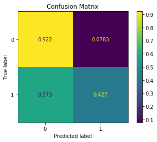
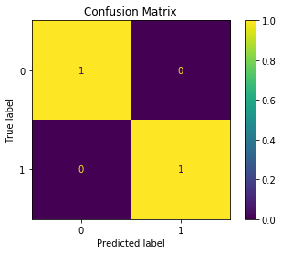
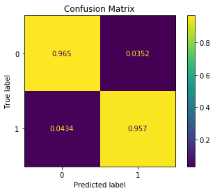
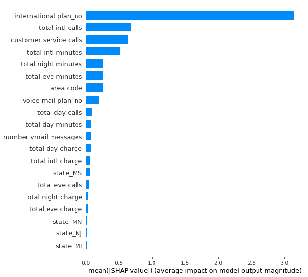
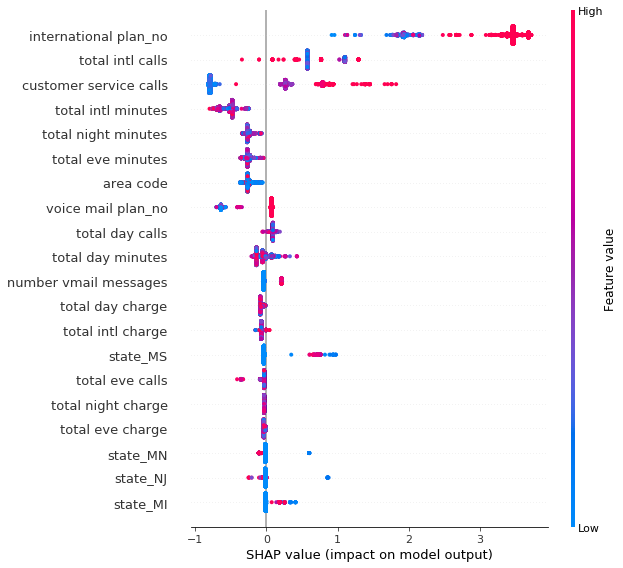

# Module 3 Final Project

## Introduction

In the following notebook we will be uncovering information from a dataset. Particularly, we will be understanding why a customer churns. To do this we will be walking through two classification models. The data we will be reviewing will be for a telecommunication. What we explore throughout this is, which features (columns) are the most important. We also need to understand their importance, meaning, is it important because it causes churn or is it important because it does not cause churn. This will be the main goal to understand throughout this notebook.

## The Dataset (Obtaining the data)

For this project, I'll be working with a telecommunication dataset. This dataset holds information on over 3.3k clients and informs us on whether or not they churn. The dataset is made up of the following columns:
* State
* Account Length
* Area Code
* Phone Number
* account length
* area code
* phone number
* international plan
* voice mail plan
* number vmail messages
* total day minutes
* total day calls
* total day charge
* total eve minutes
* total eve calls
* total eve charge
* total night minutes
* total night calls
* total night charge
* total intl minutes
* total intl calls
* total intl charge
* customer service calls
* churn

## Cleaning Data (Scrub)
I needed to view the data to make sure there were no null values, random strings and outliers that would impact our information negatively. To do this I needed to:
* Remove any unnecessary columns that didn't fit what we were solving for (phone number).
* Checked for Null values and either removed the rows in its entirety or filled them with zeroes.
* Seperated my columns into X and y dataframes.
* X was every other column (features) and y was my target (Churn).
* Since churn was in boolean I then converted it to an integer.

## Exploring Data
I wanted to get an understanding of some of the correlations occuring post cleaning my data. I went through and categorized my features into four groups Days, Minutes, Calls and Charge. I wanted to see how these groups interacted with churn so I could get a better idea of correlation.

## Modeling Data
Finally I needed to model my data. What was important to me was recall and accuracy. We needed to first make sure we had an accurate model. Recall expresses the ability to find all relevant instances in a dataset so this needed to be as close to 1 as we could get.

I chose to use a total of 3 models. Random Forests, XGB and Gridsearch. As we explore the data we will find which model performed the best in regards to recall. We want to make sure we are more sensitive / accurate when it comes to churn.

Random Forests

XGB

GridSearchCV

Feature Importance

## Interpreting the Data

Following the exploration of the dataset we can conclude on a few things. That our model performed very well. We found a 60% accuracy using our random forests model, a 95% accuracy after apply XGB Boost and finally a 93% accuracy with our gridsearch parameters. The other important result we wanted to look at was Recall. After reviewing the information we can confirm that the top 5 most important features are:

- International Plan Number (more likely to churn)
- Total International Calls (less likely to churn)
- Total International Minutes (less likely to churn)
- Customer Service Calls (more likely to churn)
- Voicemail Plan (more likely to churn)

Moving forward, we recommend that our telecommunications client looks into the payment plan that goes into their international plan. Those who do have an international plan and have higher minutes and calls are less likely to churn. But those who do not use it as frequently as the others have been found to churn more frequently. We'd recommend looking at different pricing options for lower minute / call volumes from users. I'd recommend reducing the amount of customer service calls. The customers problems should be solved by the first or second call. The more calls they make the higher the likelihood there is of this customer churning. Finally with the voicemail plan we'd recommend looking into the pricing plan with this as well. We found that there were a higher amount of people who churned while under the plan.
